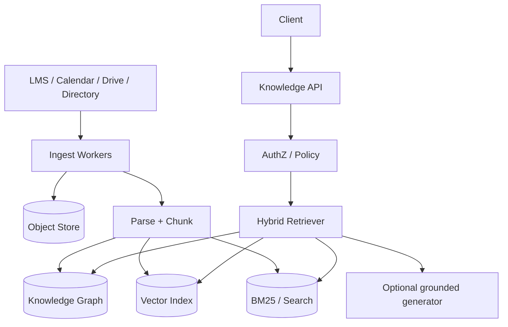
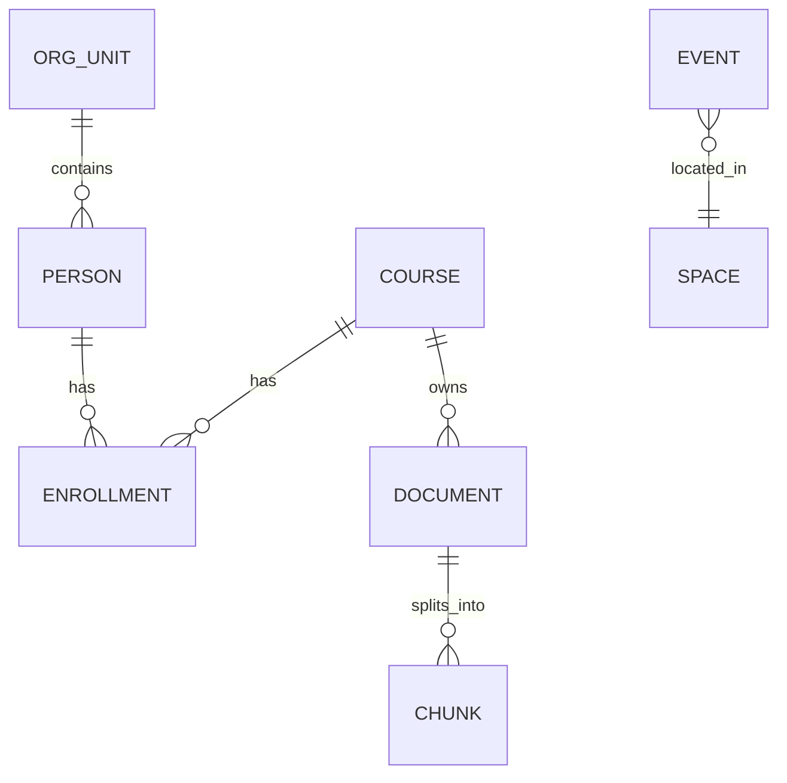
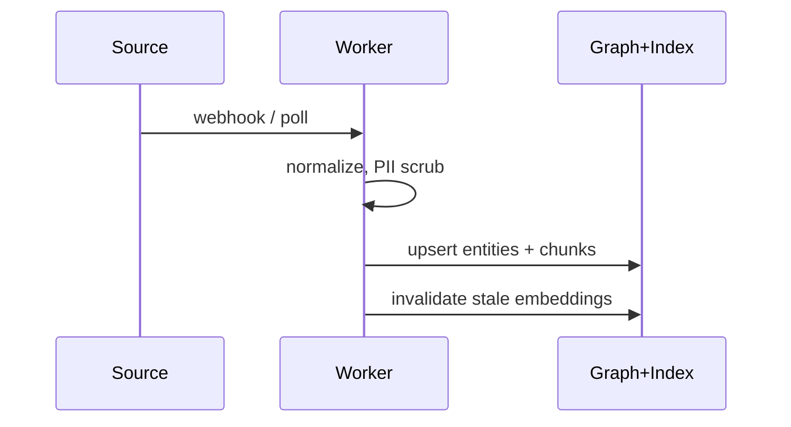

# Campus OS Knowledge Layer

Conceptual design for a **campus knowledge & retrieval layer** — the kind of substrate a CampusOS-style product would sit on (courses, people, spaces, events, docs). This is an original architecture sketch for portfolio discussion; it does **not** reproduce proprietary CampusOS code or internal schemas.

## Problem

Campuses have fragmented knowledge: LMS pages, PDFs, club Notion docs, calendars, directory listings. Students and staff need a single retrieval surface that is **permission-aware**, fresh enough, and explainable (“why this result?”).

## Goals

- Ingest heterogeneous campus sources (syllabi, announcements, FAQs, org charts)
- Unified search + Q&A over a **knowledge graph + document index**
- Enforce org roles (student / TA / faculty / staff) on every read path
- Auditability: cite sources; no silent hallucination in grounded answers

## High-level design

## Core entities (illustrative)

| Entity | Examples |
|--------|----------|
| Person | student, faculty, staff |
| Course | term-scoped offering |
| OrgUnit | department, club |
| Space | room, lab |
| Event | lecture, deadline |
| Document / Chunk | syllabus section, FAQ answer |

Edges encode relationships used for **graph expansion** before vector search (e.g., course → prerequisites → related FAQs).

## Retrieval path

1. **AuthN / AuthZ** — expand user capabilities (courses enrolled, clubs joined)  
2. **Query understanding** — intent: person lookup vs policy vs “when is X”  
3. **Hybrid retrieve** — lexical + vector + graph neighbors, filtered by ACL tags on chunks  
4. **Rerank** — freshness, authority of source, personalization within policy  
5. **Answer (optional)** — LLM only with citations to chunk IDs; refuse if evidence weak  

## Permissions model

- Every chunk carries `acl_tags` (e.g., `course:CS101:students`, `org:club-robotics:members`)  
- Retriever **must** filter before ranking — never retrieve-then-hope  
- Staff break-glass paths are audited  

## Ingest & freshness

- Prefer webhooks; fall back to incremental crawl  
- Version documents; soft-delete removed content  
- SLO: announcement visible in search &lt; 5 minutes after publish  

## Non-goals (for v1)

- Replacing the LMS gradebook  
- Cross-campus data brokerage without contracts  
- Unbounded open-web browsing from the answer path  

## Trade-offs

| Decision | Rationale |
|----------|-----------|
| Graph + lexical + vectors | Campus queries are relational *and* fuzzy |
| ACL on chunks | Safer than post-filter on large candidate sets |
| Citations required | Builds trust with faculty/admin stakeholders |

## What I’d ship first

1. Course + person + document graph; BM25 + embeddings on syllabus/FAQ corpus  
2. Strict ACL filter in retriever  
3. Cited Q&A in a single pilot department before campus-wide rollout  

---

*These notes are educational/portfolio architecture. They intentionally avoid proprietary implementation details.*
