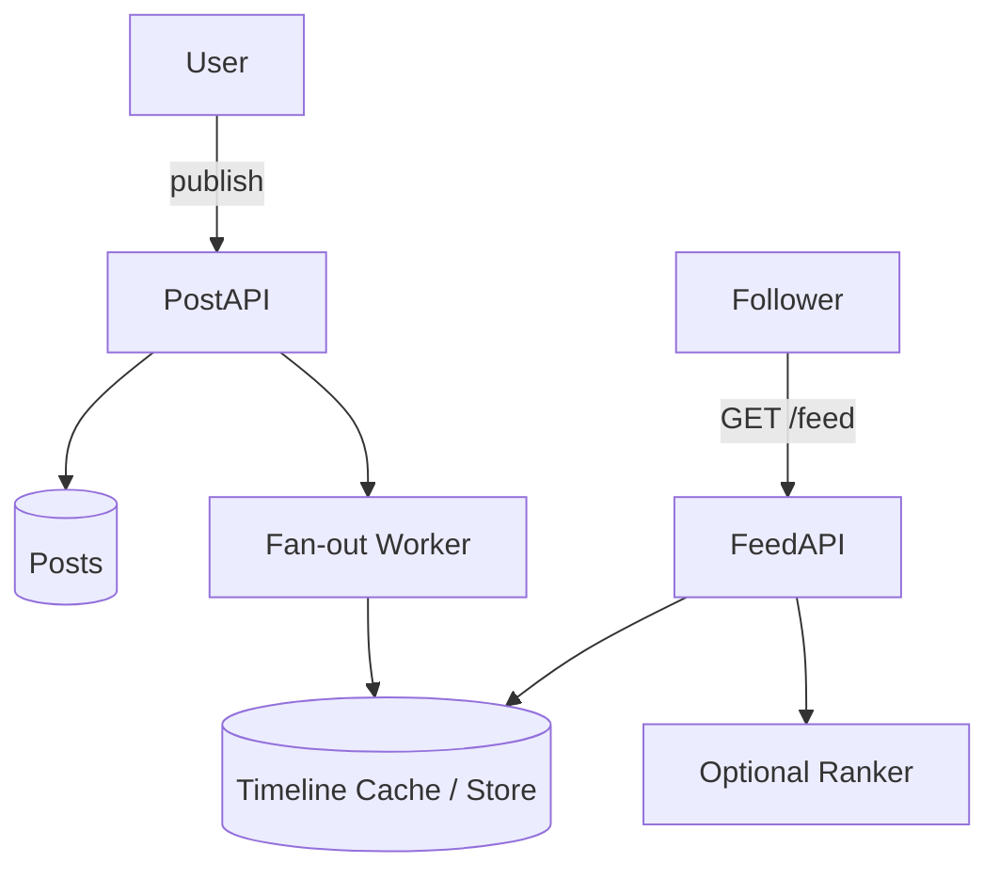
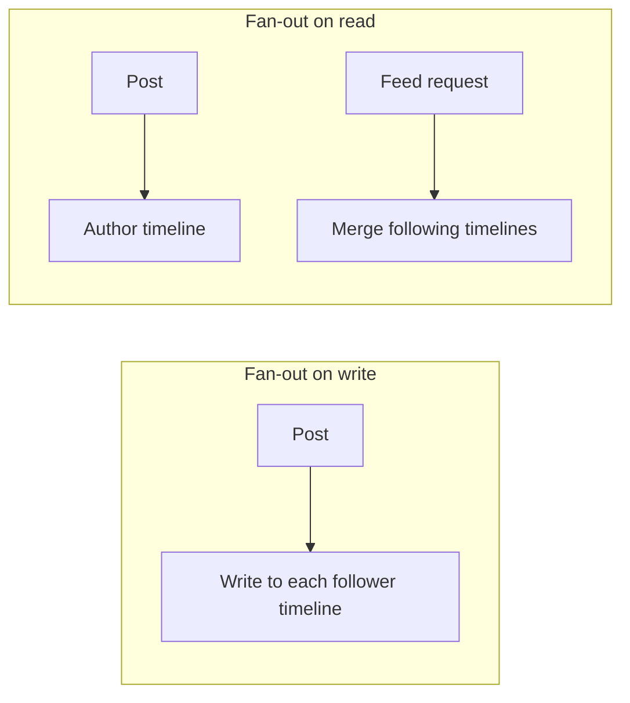

# News Feed

Design a home timeline: users post; followers see a ranked feed.

## Requirements

**Functional**
- Publish post
- Fetch home feed (paginated)
- Follow / unfollow

**Non-functional**
- Celebrity problem (huge fan-out)
- Freshness vs ranking quality
- Target: 10M DAU, fan-out heavy reads

## High-level design



## Fan-out strategies



| Strategy | When |
|----------|------|
| Push (write) | Normal users; precompute feed; fast reads |
| Pull (read) | Celebrities; avoid millions of writes |
| Hybrid | Push for normal; pull celebs at read time |

## Data model (conceptual)

```text
users(id, ...)
follows(follower_id, followee_id, created_at)
posts(id, author_id, body, created_at, ...)
timeline_entries(user_id, post_id, created_at, score?)  -- for push model
```

- Cassandra / Dynamo-style wide rows for timelines (user_id → time-ordered posts)
- Posts in a document / primary store with strong identity

## Ranking

- Early: reverse chronological
- Later: features — affinity, recency, engagement predictions
- Keep ranking offline/nearline; serve from precomputed scores when possible

## Failure & consistency

- Feed is **eventually consistent** — missing a post for seconds is OK
- Idempotent fan-out workers; at-least-once queue with dedupe by `post_id`
- Soft deletes: tombstones or filter at read

## What I’d ship first

1. Hybrid fan-out: push for users under N followers; pull above N  
2. Redis/Cassandra timeline lists + Postgres for social graph  
3. Chronological first; add ranking service behind a feature flag  
