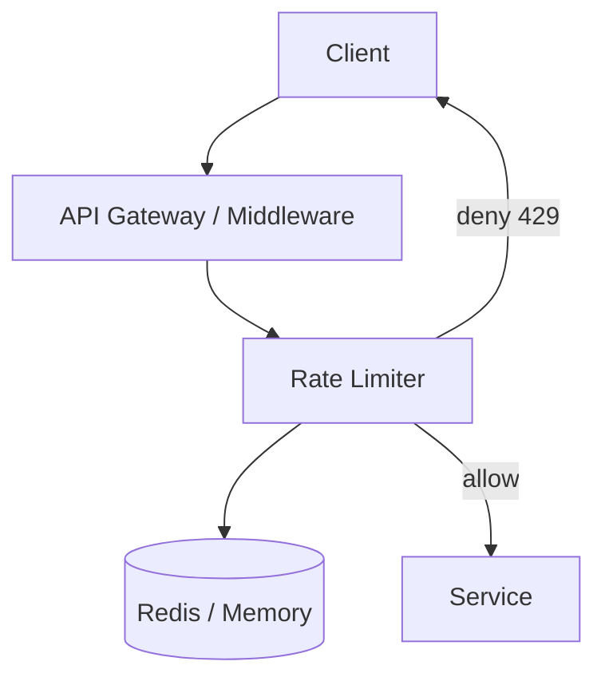
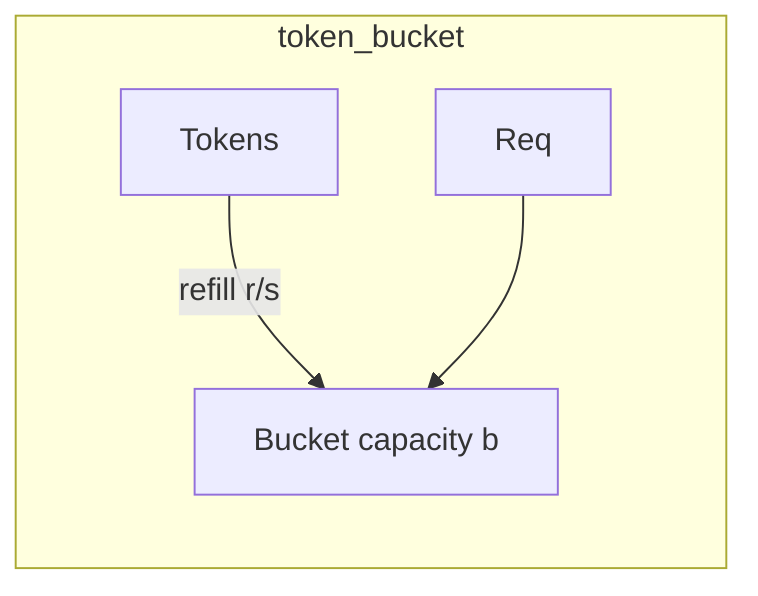
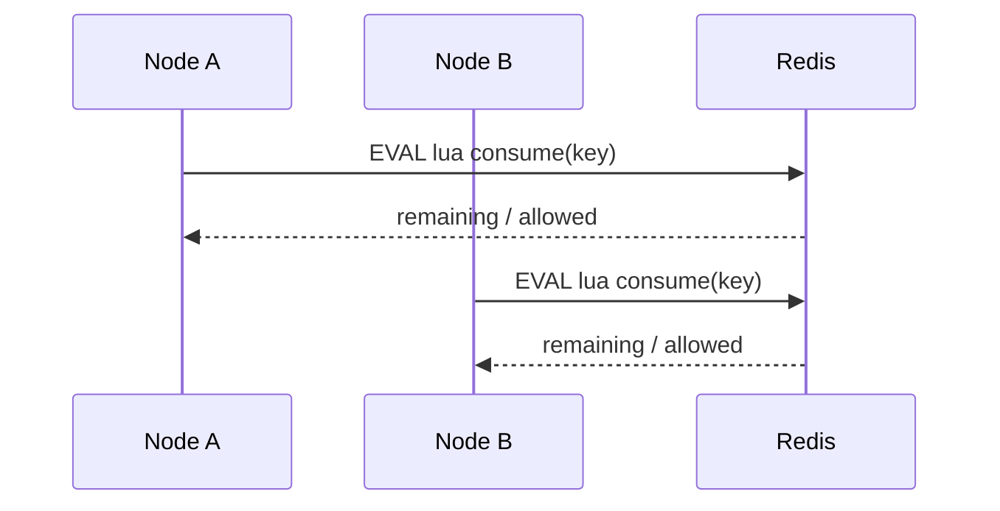

# Rate Limiter

Protect APIs from abuse while staying fair to legitimate clients.

## Requirements

- Limit by API key / user / IP (pluggable key)
- Algorithms: token bucket and sliding window (configurable per route)
- Distributed: multiple API nodes share a consistent budget
- Fail policy: configurable fail-open vs fail-closed when store is down

## High-level design





## Algorithms

### Token bucket
- Capacity `b`, refill rate `r` tokens/sec
- Good for bursts; smooth average rate
- Redis: `INCR` + TTL or Lua for atomicity

### Sliding window (log / counter hybrid)
- Fixed window is simple but boundary-bursty
- Sliding window log: store timestamps; accurate, more memory
- Sliding window counter: weight current + previous window — good balance

## Distributed coordination



- Single Redis (or Redis Cluster) as source of truth for counters
- Lua scripts keep check+decrement atomic
- Local in-process limiter as L1 only when approximate limits are OK

## API for middleware

```ts
interface RateLimitResult {
  allowed: boolean;
  remaining: number;
  resetAt: number; // epoch ms
}

limit(key: string, policy: Policy): Promise<RateLimitResult>
```

Response headers: `X-RateLimit-Limit`, `X-RateLimit-Remaining`, `Retry-After`

## Trade-offs

| Choice | Pros | Cons |
|--------|------|------|
| Redis central | Accurate global limit | Extra hop; Redis SPOF unless HA |
| Local only | Fast | Uneven under multi-node |
| Fail-open | Availability | Abuse during outage |
| Fail-closed | Safety | False denials |

## What I’d ship first

1. Token bucket in Redis + Lua per API key  
2. Route-level policies in config  
3. Then: sliding window for stricter fairness, and shadow-mode metrics before enforce  
