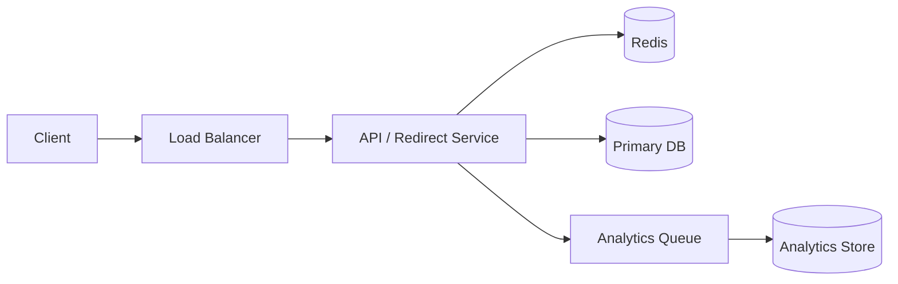
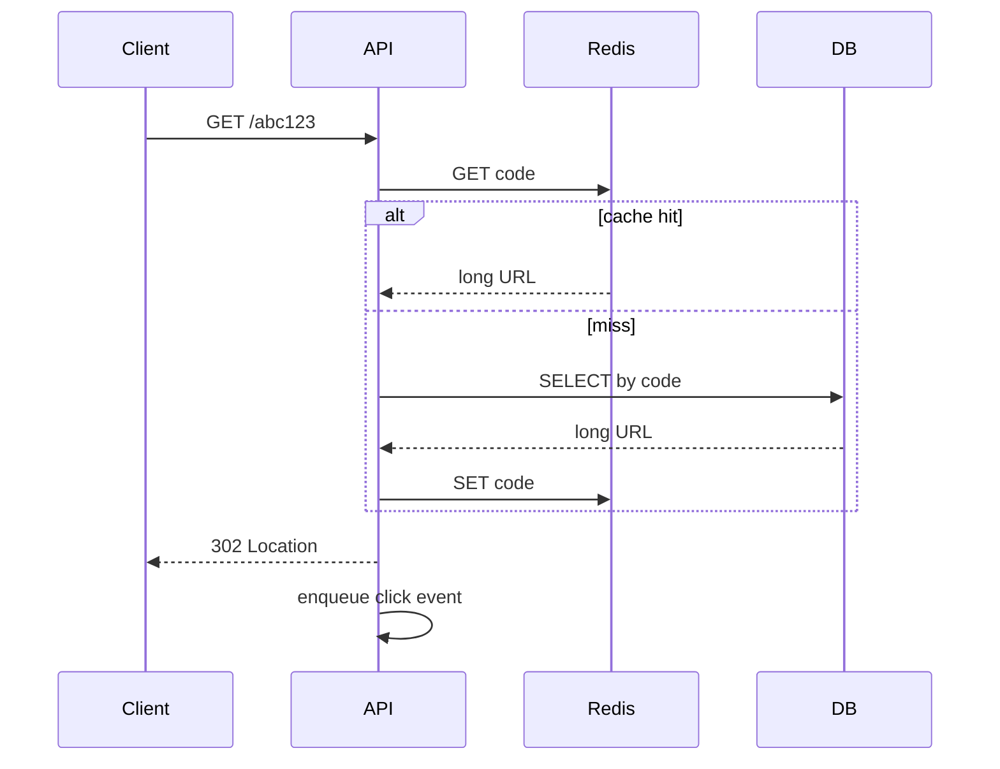

# URL Shortener

Design a service that maps long URLs to short codes and redirects with high availability.

## Requirements

**Functional**
- Create short URL from a long URL (optional custom alias)
- Redirect `GET /{code}` → 302 to original URL
- Optional: click analytics (counts, coarse geo)

**Non-functional**
- Read-heavy (redirects ≫ creates)
- Low latency redirects (p99 &lt; 50ms in-region)
- Codes unique; soft-delete / TTL optional
- Target: 100M URLs, 10k QPS redirects peak

## High-level design





## API sketch

| Method | Path | Notes |
|--------|------|-------|
| `POST` | `/v1/urls` | body: `{ url, alias? }` → `{ code, shortUrl }` |
| `GET` | `/{code}` | 302 redirect |
| `GET` | `/v1/urls/{code}/stats` | authenticated; click counts |

## Encoding & collision

- Generate 64-bit ID (Snowflake / DB sequence), base62 encode → ~11 chars
- Or random 7–8 char base62 with uniqueness check (simpler at lower scale)
- Custom aliases: reserved namespace + uniqueness constraint

## Data model

```text
urls(
  code PK,
  long_url TEXT NOT NULL,
  user_id NULL,
  created_at,
  expires_at NULL
)
```

- Primary key on `code`; secondary index on `user_id` for “my links”
- Store analytics out-of-band (append-only events → aggregates)

## Scaling

| Concern | Approach |
|---------|----------|
| Hot keys | Redis cache; TTL + stampede protection |
| Write shard | Range / hash on ID; keep redirect path key-value simple |
| Analytics | Async queue; never on critical redirect path |
| Consistency | Create: strong uniqueness; Redirect: eventual OK if cache lags briefly |

## Failure modes

- Cache miss storm → DB load → rate-limit creates, cache warming
- DB primary down → redirects from cache still work; creates fail closed
- Alias abuse → auth, rate limits, content policy on long URL

## What I’d ship first

1. Single region, Postgres + Redis, base62 from sequence  
2. Async click events to a log table  
3. Then: multi-region read replicas + CDN for static landing pages  
